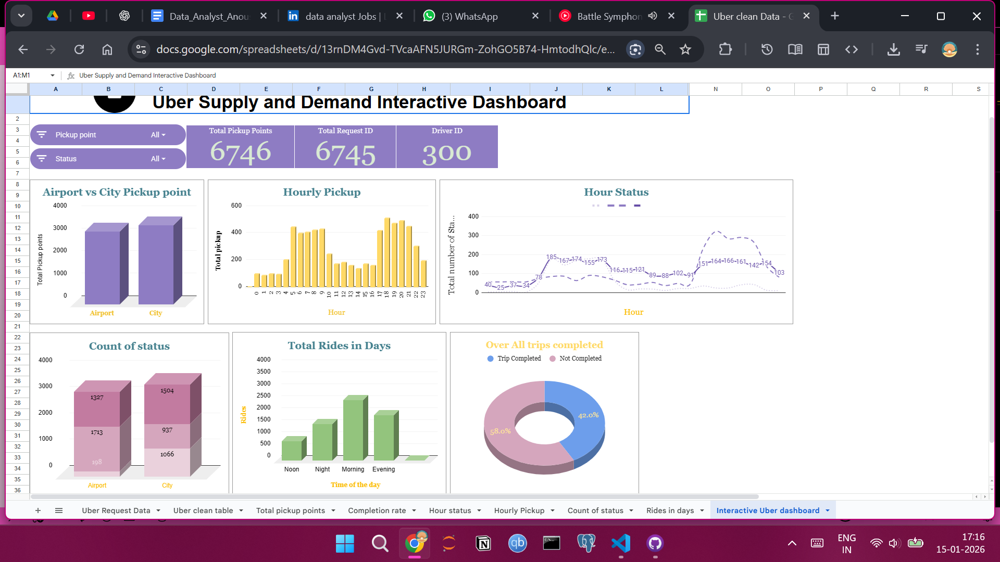

# Uber Supply Demand Analysis Report

## 📌 Project Overview

This project analyzes **Uber supply–demand gaps** to identify patterns where ride requests exceed driver availability. The goal is to uncover actionable insights that can help improve **ride fulfillment rate, driver allocation, and customer experience**.

The analysis focuses on **time-based demand patterns**, request statuses, and supply shortages using Python-based EDA techniques.

---

## 🎯 Objectives

* Analyze ride request trends across different time intervals
* Identify peak hours with high unmet demand
* Compare supply vs demand patterns
* Highlight key operational bottlenecks
* Provide data-driven recommendations

---

## 🧰 Tools & Technologies

* **Python** (Pandas, NumPy)
* **Jupyter Notebook**
* **Excel** (data cleaning & preprocessing)
* **Matplotlib / Seaborn** (visualization)

---

## 📂 Repository Structure

```
├── UBER_SUPPLY_DEMAND_EDA.ipynb
├── Cleaned_Uber_Request_Data.xlsx
├── Screenshots/
│   ├── Uber_Supply-Demand_dashboard_image.png
│   ├── Uber_Supply-Demand_status.png
│   └── Uber_clean_dataset.png
└── README.md
```

---

## 📊 Dashboard Preview

 

---

## 🔍 Key Insights

* Peak demand occurs during **morning and evening rush hours**
* Significant supply shortages observed during **late-night time slots**
* High number of cancellations and unfulfilled requests during peak demand
* Demand is consistent, but driver availability fluctuates

---

## 💡 Recommendations

* Increase driver incentives during high-demand time slots
* Improve predictive driver allocation using historical trends
* Introduce surge-based supply balancing strategies
* Monitor cancellation patterns to reduce unmet demand

---

## 🚀 How to Run the Project

1. Clone the repository
2. Open `UBER_SUPPLY_DEMAND_EDA.ipynb` in Jupyter Notebook or VS Code
3. Ensure required Python libraries are installed
4. Run cells sequentially to reproduce the analysis

---

## 👩‍💻 Author

**Anoushka Thakur**
Data Analyst Intern
SQL • Python • Excel • Pandas • Data Cleaning • EDA

---

## 📬 Contact

Feel free to connect with me on LinkedIn or reach out for feedback and collaboration opportunities.
